# The Data Packet 🎙️

**Automated podcast generation from news articles using AI** - Transform tech news into engaging podcast content with a single command.

[](https://github.com/TheWinterShadow/the_data_packet/pkgs/container/the-data-packet)
[](https://www.python.org/downloads/)
[](LICENSE)
[](https://github.com/TheWinterShadow/the_data_packet/actions)

## 🎯 What It Does

The Data Packet automatically transforms tech news articles into professional podcast episodes:

1. **📰 Scrapes** latest articles from Wired.com (security, guides, etc.)
2. **🤖 Generates** engaging dialogue scripts using Claude AI  
3. **🎙️ Creates** multi-speaker audio using Gemini TTS
4. **📦 Delivers** complete podcast episodes ready for publishing

## ✨ Key Features

- **🐳 Docker-First**: Run anywhere with a single command
- **🤖 AI-Powered**: Claude for scripts, Gemini for realistic voices
- **⚙️ Configurable**: Multiple voices, show formats, categories
- **🔒 Secure**: Non-root containers, environment-based secrets
- **📊 Production-Ready**: Health checks, logging, error handling
- **🚀 GitHub Actions**: Automated builds and releases

## 🚀 Quick Start

### Option 1: Pull from GitHub Container Registry (Recommended)

```bash
# Pull the latest image
docker pull ghcr.io/thewintershadow/the-data-packet:latest

# Run with your API keys
docker run --rm \
  -e ANTHROPIC_API_KEY="your-claude-key" \
  -e GOOGLE_API_KEY="your-gemini-key" \
  -v "$(pwd)/output:/app/output" \
  ghcr.io/thewintershadow/the-data-packet:latest
```

### Option 2: Build Locally

```bash
git clone https://github.com/TheWinterShadow/the_data_packet.git
cd the_data_packet
docker build -t the-data-packet .

docker run --rm \
  -e ANTHROPIC_API_KEY="your-key" \
  -e GOOGLE_API_KEY="your-key" \
  -v "$(pwd)/output:/app/output" \
  the-data-packet
```

## 📖 Documentation

- **[SIMPLE_USAGE.md](SIMPLE_USAGE.md)** - **NEW**: Simplified interface with S3 upload
- **[USAGE.md](USAGE.md)** - Complete usage guide and examples  
- **[DOCKER.md](DOCKER.md)** - Docker deployment and configuration
- **[docs/](docs/)** - API documentation and development guides

## ⚡ Simple Python Interface (NEW)

For easier integration, use the simplified Python interface with automatic S3 upload:

```python
from the_data_packet import SimplePodcastGenerator

# Initialize with S3 bucket (optional)
generator = SimplePodcastGenerator(s3_bucket="my-podcast-bucket")

# Generate and upload podcast in one line
result = generator.generate_podcast(show_name="My Tech Show")

if result.success:
    print(f"Podcast created: {result.audio_path}")
    print(f"S3 URL: {result.s3_result.s3_url}")
```

**Simple CLI:**
```bash
# Generate and upload to S3
simple-podcast-generator --show-name "Daily Tech" --s3-bucket my-podcast-bucket

# Upload existing audio file  
simple-podcast-generator --upload-only episode.wav --show-name "Tech Show" --episode-date 2025-12-13
```

## 📖 Full Documentation

## 🎛️ Command Examples

```bash
# Generate complete podcast (default)
docker run --rm --env-file .env -v "$(pwd)/output:/app/output" \
  ghcr.io/thewintershadow/the-data-packet:latest

# Generate script only
docker run --rm --env-file .env -v "$(pwd)/output:/app/output" \
  ghcr.io/thewintershadow/the-data-packet:latest --script-only

# Custom show with different voices  
docker run --rm --env-file .env -v "$(pwd)/output:/app/output" \
  ghcr.io/thewintershadow/the-data-packet:latest \
  --show-name "Tech Brief" \
  --voice-a Charon --voice-b Aoede \
  --categories security

# Audio only from existing script
docker run --rm --env-file .env -v "$(pwd)/output:/app/output" \
  ghcr.io/thewintershadow/the-data-packet:latest \
  --audio-only --script-file /app/output/episode_script.txt
```

## 🎙️ Sample Output

**Generated Script:**
```
Alex: Hey everyone, welcome to Tech Daily! I'm Alex.

Sam: And I'm Sam. Wednesday, December 12th, and we've got some fascinating developments in AI security today.

Alex: We really do. Starting with this new research from Stanford about prompt injection attacks - this one's pretty eye-opening.

Sam: Oh yeah, the implications are huge for anyone building AI applications...
```

**Generated Audio:** Multi-speaker WAV file with natural conversation flow

## 🏗️ Architecture



```mermaid
graph LR
    A[📰 Article Scraping] --> B[🤖 AI Script Generation]
    B --> C[🎙️ Audio Generation]  
    C --> D[📦 Podcast Episode]
    
    A1[RSS Feeds] --> A
    A2[Web Scraping] --> A
    A3[Content Extraction] --> A
    
    B1[Claude AI] --> B
    B2[Dialogue Templates] --> B
    
    C1[Gemini TTS] --> C
    C2[Multi-Speaker Voices] --> C
```

## 🔧 Requirements

**API Keys (Required):**
- **Anthropic API Key** - For Claude AI script generation
- **Google API Key** - For Gemini TTS audio generation

**Docker (Required):**
- Docker Engine 20.10+
- Docker Compose 2.0+ (optional, for easier deployment)

## 🛠️ Development

```bash
# Clone repository
git clone https://github.com/TheWinterShadow/the_data_packet.git
cd the_data_packet

# Install for development
pip install -e ".[dev]"

# Run tests
pytest tests/ -v

# Build Docker image
docker build -t the-data-packet:dev .
```

## 📊 Project Status

- ✅ **Production Ready**: Used for generating real podcasts
- ✅ **Actively Maintained**: Regular updates and improvements  
- ✅ **Docker Optimized**: Multi-platform builds (amd64, arm64)
- ✅ **CI/CD Pipeline**: Automated testing and releases
- ✅ **Security Scanned**: Vulnerability scanning with Trivy

## 🤝 Contributing

1. Fork the repository
2. Create a feature branch (`git checkout -b feature/amazing-feature`)
3. Commit your changes (`git commit -m 'Add amazing feature'`)
4. Push to the branch (`git push origin feature/amazing-feature`)
5. Open a Pull Request

## 📄 License

This project is licensed under the MIT License - see the [LICENSE](LICENSE) file for details.

## 🙏 Acknowledgments

- **Anthropic** for Claude AI capabilities
- **Google** for Gemini TTS technology
- **Wired.com** for excellent tech journalism

---

⭐ **Star this repo** if you find it useful! | 🐳 **[View on GitHub Container Registry](https://github.com/TheWinterShadow/the_data_packet/pkgs/container/the-data-packet)**

## 🚀 Quick Start

### Docker Deployment (Recommended)

The easiest way to use The Data Packet is through Docker:

```bash
# 1. Clone the repository
git clone https://github.com/TheWinterShadow/the_data_packet.git
cd the_data_packet

# 2. Setup environment variables
cp .env.template .env
# Edit .env with your API keys

# 3. Build and run
./deploy.sh build
./deploy.sh run
```

### Docker Commands

```bash
# Build the image
docker build -t the-data-packet .

# Run complete podcast generation
docker run --rm \
  -e ANTHROPIC_API_KEY="your-claude-key" \
  -e GOOGLE_API_KEY="your-gemini-key" \
  -v "$(pwd)/output:/app/output" \
  the-data-packet

# Run script-only generation  
docker run --rm \
  -e ANTHROPIC_API_KEY="your-claude-key" \
  -v "$(pwd)/output:/app/output" \
  the-data-packet --script-only

# Run with custom parameters
docker run --rm \
  -e ANTHROPIC_API_KEY="your-claude-key" \
  -e GOOGLE_API_KEY="your-gemini-key" \
  -v "$(pwd)/output:/app/output" \
  the-data-packet \
  --show-name "My Tech Podcast" \
  --categories security \
  --voice-a Charon \
  --voice-b Aoede
```

### Local Installation

For development or local use:

```bash
git clone https://github.com/TheWinterShadow/the_data_packet.git
cd the_data_packet
pip install -e .
```

### Set up API Keys

```bash
export ANTHROPIC_API_KEY="your-claude-api-key"
export GOOGLE_API_KEY="your-gemini-api-key"
```

### Generate a Podcast (Local)

```python
from the_data_packet import PodcastPipeline, PipelineConfig

# Create configuration
config = PipelineConfig(
    episode_date="Monday, December 16, 2024",
    show_name="Daily Tech Update"
)

# Run complete pipeline
pipeline = PodcastPipeline(config)
result = pipeline.run()

if result.success:
    print(f"✅ Podcast generated!")
    print(f"📝 Script: {result.script_path}")
    print(f"🎵 Audio: {result.audio_path}")
```

## 📋 Usage Examples

### 1. Complete Automated Pipeline

```python
from the_data_packet import PodcastPipeline, PipelineConfig

config = PipelineConfig(
    episode_date="Wednesday, December 18, 2024",
    categories=["security", "guide"],
    generate_script=True,
    generate_audio=True,
    output_directory="./my_podcast"
)

pipeline = PodcastPipeline(config)
result = pipeline.run()
```

### 2. Script Generation Only

```python
config = PipelineConfig(
    generate_script=True,
    generate_audio=False,  # Skip audio
    categories=["security"]
)

pipeline = PodcastPipeline(config)
result = pipeline.run()
```

### 3. Individual Components

```python
from the_data_packet import WiredArticleScraper, PodcastScriptGenerator, GeminiTTSGenerator

# Step 1: Scrape articles
scraper = WiredArticleScraper()
articles = scraper.get_both_latest_articles()

# Step 2: Generate script
script_gen = PodcastScriptGenerator(show_name="Tech Brief")
script = script_gen.generate_complete_episode(
    articles=[f"TITLE: {a.title}, CONTENT: {a.content}" for a in articles.values()],
    episode_date="Today"
)

# Step 3: Generate audio
audio_gen = GeminiTTSGenerator()
result = audio_gen.generate_audio(script, "episode.wav")

scraper.close()
```

### 4. Custom Configuration

```python
from the_data_packet import PipelineConfig, Settings, setup_logging

# Setup custom logging
setup_logging(level="DEBUG")

# Custom configuration
config = PipelineConfig(
    show_name="Custom Tech Talk",
    voice_a="Charon",    # Different voice
    voice_b="Aoede",     # Different voice
    max_articles_per_category=2,
    save_intermediate_files=True
)

# Get current settings
settings = Settings()
print(f"Default show: {settings.show_name}")
print(f"Available voices: {GeminiTTSGenerator.list_available_voices()}")
```

## 🏗️ Architecture

```
the_data_packet/
├── 🎬 workflows/          # Complete pipeline orchestration
│   ├── PodcastPipeline    # Main workflow coordinator
│   └── PipelineConfig     # Configuration management
├── 🕷️ scrapers/           # Web scraping components
│   └── WiredArticleScraper # Article extraction from Wired.com
├── 🤖 ai/                 # AI content generation
│   ├── ClaudeClient       # Anthropic Claude API client
│   ├── PodcastScriptGenerator # Script generation logic
│   └── prompts/           # AI prompts and templates
├── 🎙️ audio/              # Audio generation
│   └── GeminiTTSGenerator # Gemini Text-to-Speech
├── ⚙️ config/             # Configuration management
│   └── Settings           # Application settings
├── 🛠️ core/               # Core utilities
│   ├── exceptions         # Custom exception classes
│   └── logging_config     # Logging setup
├── 📄 models/             # Data models
│   └── ArticleData        # Article data structure
└── 🔧 utils/              # Utility components
    ├── HTTPClient         # HTTP request handling
    ├── RSSClient          # RSS feed parsing
    └── extractors/        # Content extraction utilities
```

## 📊 Workflow

```mermaid
graph LR
    A[📰 Scrape Articles] --> B[🤖 Generate Script]
    B --> C[🎙️ Create Audio]
    C --> D[✅ Complete Podcast]
    
    A --> A1[RSS Feeds]
    A --> A2[Web Scraping]
    A --> A3[Content Extraction]
    
    B --> B1[Claude AI]
    B --> B2[Script Templates]
    B --> B3[Multi-speaker Dialogue]
    
    C --> C1[Gemini TTS]
    C --> C2[Voice Selection]
    C --> C3[Audio Processing]
```



## 🔧 Configuration

### Environment Variables

```bash
# Required
ANTHROPIC_API_KEY=your-claude-api-key
GOOGLE_API_KEY=your-gemini-api-key

# Optional
THE_DATA_PACKET_LOG_LEVEL=INFO
THE_DATA_PACKET_OUTPUT_DIR=./output
THE_DATA_PACKET_SHOW_NAME="Custom Show Name"
```

### Configuration File

```python
from the_data_packet.config import Settings

settings = Settings(
    show_name="My Tech Podcast",
    claude_model="claude-3-5-sonnet-20241022",
    gemini_model="gemini-2.5-pro-preview-tts",
    default_voice_a="Puck",
    default_voice_b="Kore",
    max_tokens=3000,
    temperature=0.7,
    output_directory="./episodes"
)
```

## 🎙️ Available Voices

| Voice | Description |
|-------|-------------|
| **Puck** | Energetic and dynamic |
| **Charon** | Deep and authoritative |
| **Kore** | Warm and conversational |
| **Fenrir** | Rich and engaging |
| **Aoede** | Clear and professional |
| **Zephyr** | Natural and balanced |

## 📈 What's New in v2.0

### 🎯 **Major Improvements**

- ✅ **Complete rewrite** with professional architecture
- ✅ **Pipeline orchestration** for end-to-end automation  
- ✅ **Configuration management** with environment variables
- ✅ **Comprehensive error handling** and logging
- ✅ **Type hints** throughout the codebase
- ✅ **Modular design** for easier testing and extension
- ✅ **Resource management** with proper cleanup
- ✅ **Progress tracking** and result validation

### 📊 **Before vs After**

| Feature | v1.0 (Old) | v2.0 (New) |
|---------|------------|------------|
| **Setup** | Manual imports, hardcoded keys | Configuration management, env vars |
| **Error Handling** | Basic try/catch | Comprehensive with retry logic |
| **Logging** | Print statements | Professional logging framework |
| **Architecture** | Scattered modules | Clean, layered architecture |
| **Usage** | 20+ lines of code | 3 lines for complete pipeline |
| **Testing** | Difficult | Modular, testable components |
| **Documentation** | Minimal | Comprehensive with examples |

## 🔍 Error Handling

The package includes comprehensive error handling:

```python
from the_data_packet import PodcastPipeline
from the_data_packet.core.exceptions import AIGenerationError, AudioGenerationError

try:
    pipeline = PodcastPipeline()
    result = pipeline.run()
    
    if not result.success:
        print(f"Pipeline failed: {result.error_message}")
        
except AIGenerationError as e:
    print(f"AI generation failed: {e}")
except AudioGenerationError as e:
    print(f"Audio generation failed: {e}")
```

## 🧪 Development

### Setup Development Environment

```bash
git clone https://github.com/TheWinterShadow/the_data_packet.git
cd the_data_packet
pip install -e ".[dev]"
```

### Run Tests

```bash
pytest tests/ -v
```

### Code Quality

```bash
# Type checking
mypy the_data_packet/

# Linting  
flake8 the_data_packet/

# Format code
black the_data_packet/
```

## 🤝 Contributing

1. Fork the repository
2. Create a feature branch (`git checkout -b feature/amazing-feature`)
3. Commit your changes (`git commit -m 'Add amazing feature'`)
4. Push to the branch (`git push origin feature/amazing-feature`)
5. Open a Pull Request

## 📄 License

This project is licensed under the MIT License - see the [LICENSE](LICENSE) file for details.

## 🙏 Acknowledgments

- **Anthropic** for Claude AI API
- **Google** for Gemini TTS capabilities
- **Wired.com** for providing excellent tech journalism

---

**⭐ If you find this useful, please star the repository!**
pip install -e ".[dev]"
```

## Quick Start

### Python API

```python
from the_data_packet import WiredArticleScraper

# Initialize the scraper
scraper = WiredArticleScraper()

# Get the latest security article
security_article = scraper.get_latest_security_article()
print(f"Title: {security_article.title}")
print(f"Author: {security_article.author}")
print(f"Content: {security_article.content[:200]}...")

# Get both latest articles
articles = scraper.get_both_latest_articles()
for category, article in articles.items():
    print(f"{category}: {article.title}")

# Get multiple articles
security_articles = scraper.get_multiple_articles("security", limit=5)
for article in security_articles:
    print(f"- {article.title}")

# Clean up
scraper.close()
```

### Command Line Interface

The package includes a CLI tool accessible via the `wired-scraper` command:

```bash
# Get latest security article
wired-scraper security

# Get latest guide article  
wired-scraper guide

# Get both latest articles
wired-scraper both

# Get multiple articles
wired-scraper security --count 5

# Scrape a specific URL
wired-scraper --url "https://www.wired.com/story/example-article/"

# Output as text instead of JSON
wired-scraper security --format text

# Enable verbose logging
wired-scraper security --verbose
```

### Docker Usage

Build and run the Docker container:

```bash
# Build the image
docker build -t wired-scraper .

# Run the container (outputs to ./output directory)
docker run -v $(pwd)/output:/app/output wired-scraper

# Run with custom command
docker run -v $(pwd)/output:/app/output wired-scraper python -m the_data_packet.cli security --format text

# Interactive mode
docker run -it wired-scraper bash
```

## API Reference

### WiredArticleScraper

Main scraper class for extracting articles from Wired.com.

```python
class WiredArticleScraper:
    def __init__(self, timeout: int = 30, user_agent: Optional[str] = None)
    def get_latest_article(self, category: str) -> ArticleData
    def get_latest_security_article(self) -> ArticleData  
    def get_latest_guide_article(self) -> ArticleData
    def get_both_latest_articles(self) -> Dict[str, ArticleData]
    def get_multiple_articles(self, category: str, limit: int = 5) -> List[ArticleData]
    def scrape_article_from_url(self, url: str, category: Optional[str] = None) -> ArticleData
    def close(self)
```

### ArticleData

Data model for article information.

```python
@dataclass
class ArticleData:
    title: Optional[str] = None
    author: Optional[str] = None  
    content: Optional[str] = None
    url: Optional[str] = None
    category: Optional[str] = None
    
    def is_valid(self) -> bool
    def to_dict(self) -> dict
    @classmethod
    def from_dict(cls, data: dict) -> "ArticleData"
```

## Package Structure

```
the_data_packet/
├── __init__.py          # Main package exports
├── __about__.py         # Version information  
├── cli.py              # Command-line interface
├── clients/            # HTTP and RSS clients
│   ├── __init__.py
│   ├── http_client.py  # HTTP request handling
│   └── rss_client.py   # RSS feed parsing
├── extractors/         # Content extraction
│   ├── __init__.py
│   └── wired_extractor.py  # Wired.com content extractor
├── models/             # Data models
│   ├── __init__.py
│   └── article.py      # ArticleData model
└── scrapers/           # Main scraper logic
    ├── __init__.py
    └── wired_scraper.py    # WiredArticleScraper class
```

## Configuration

The package uses sensible defaults but can be configured:

```python
# Custom timeout and User-Agent
scraper = WiredArticleScraper(
    timeout=60,
    user_agent="MyBot/1.0"
)

# Access individual components
from the_data_packet.clients import RSSClient, HTTPClient
from the_data_packet.extractors import WiredContentExtractor

rss_client = RSSClient()
http_client = HTTPClient(timeout=30)
extractor = WiredContentExtractor()
```

## Development

### Running Tests

```bash
# Install development dependencies
pip install -e ".[dev]"

# Run tests
pytest

# Run tests with coverage
pytest --cov=the_data_packet --cov-report=html

# Run specific test file
pytest tests/test_models.py -v
```

### Code Quality

```bash
# Format code
black the_data_packet/ tests/

# Sort imports
isort the_data_packet/ tests/

# Lint code  
flake8 the_data_packet/ tests/

# Type checking
mypy the_data_packet/

# Security scan
bandit -r the_data_packet/
```

## Error Handling

The package includes comprehensive error handling:

```python
from the_data_packet import WiredArticleScraper
from the_data_packet.models import ArticleData

scraper = WiredArticleScraper()

try:
    article = scraper.get_latest_security_article()
    if not article.is_valid():
        print("Warning: Article data may be incomplete")
except RuntimeError as e:
    print(f"Scraping failed: {e}")
except ValueError as e:
    print(f"Invalid input: {e}")
finally:
    scraper.close()
```

## Logging

Configure logging to monitor scraping operations:

```python
import logging

# Set up logging
logging.basicConfig(
    level=logging.INFO,
    format='%(asctime)s - %(name)s - %(levelname)s - %(message)s'
)

scraper = WiredArticleScraper()
# Now all operations will be logged
```

## Contributing

1. Fork the repository
2. Create a feature branch (`git checkout -b feature/amazing-feature`)
3. Make your changes
4. Run tests (`pytest`)
5. Run code quality checks (`black`, `isort`, `flake8`, `mypy`)
6. Commit your changes (`git commit -m 'Add amazing feature'`)
7. Push to the branch (`git push origin feature/amazing-feature`)
8. Open a Pull Request

## License

This project is licensed under the MIT License - see the [LICENSE](LICENSE) file for details.

## Changelog

### Version 1.0.0

- Initial release
- Support for security and guide article categories
- Full CLI interface
- Docker containerization
- Comprehensive test suite
- Complete type annotations
