# The Data Packet 🎙️

**AI-Powered Automated Podcast Generation System** - Transform tech news articles into engaging, multi-speaker podcast episodes using cutting-edge AI technology.

[](https://github.com/TheWinterShadow/the_data_packet/pkgs/container/the-data-packet)
[](https://hub.docker.com/r/thewintershadow/the-data-packet)
[](https://hub.docker.com/r/thewintershadow/the-data-packet)
[](https://www.python.org/downloads/)
[](LICENSE)

<!-- GitHub Actions Workflow Status -->
[](https://github.com/TheWinterShadow/The-Data-Packet/actions/workflows/ci.yml)
[](https://github.com/TheWinterShadow/The-Data-Packet/actions/workflows/docker.yml)
[](https://github.com/TheWinterShadow/The-Data-Packet/actions/workflows/docs.yml)

<!-- Repository Stats -->
[](https://github.com/TheWinterShadow/The-Data-Packet/commits/main)
[](https://github.com/TheWinterShadow/The-Data-Packet/issues)
[](https://github.com/TheWinterShadow/The-Data-Packet/pulls)


## 📚 Documentation Index

### Quick Start Guides
- **[Usage Guide](USAGE.md)** - Complete usage instructions, CLI commands, and examples
- **[Docker Setup](DOCKER.md)** - Docker installation, configuration, and deployment
- **[MongoDB Configuration](MONGODB.md)** - Database setup and connection details

### Advanced Configuration  
- **[Enhanced Logging](LOGGING.md)** - JSONL logging with S3 upload capabilities

## 🚀 Quick Links

| Topic | File | Description |
|-------|------|-------------|
| Getting Started | [USAGE.md](USAGE.md) | Complete setup and usage instructions |
| Container Deployment | [DOCKER.md](DOCKER.md) | Docker build and deployment guide |
| Database Setup | [MONGODB.md](MONGODB.md) | MongoDB configuration and connection |
| Observability | [LOGGING.md](LOGGING.md) | Structured logging and S3 integration |


## 🎯 What It Does

The Data Packet is a complete end-to-end podcast generation system that:

1. **📰 Intelligently Scrapes** the latest tech news from Wired.com across multiple categories
2. **🤖 AI-Generated Scripts** using Anthropic Claude to create natural, engaging dialogue  
3. **🎙️ Multi-Speaker Audio** with Google Cloud Text-to-Speech Long Audio Synthesis for professional-quality voices without timeouts
4. **📻 Complete RSS Feeds** for podcast distribution with metadata and hosting
5. **☁️ Hybrid Cloud Integration** with AWS S3 for hosting and Google Cloud for advanced TTS processing
6. **�️ MongoDB Integration** for episode tracking and article deduplication
7. **�🔄 Full Automation** - Generate professional podcast episodes with a single command

## ✨ Key Features

### 🤖 AI-Powered Content Creation
- **Anthropic Claude Integration**: Advanced script generation with natural dialogue
- **ElevenLabs TTS**: High-quality multi-speaker audio with professional voice models
- **Intelligent Content Processing**: Smart article summarization and podcast formatting
- **Context-Aware Generation**: Creates cohesive episodes from multiple news sources

### 🐳 Production-Ready Infrastructure  
- **Docker-First Design**: Consistent deployment across environments
- **GitHub Container Registry**: Automated builds and version management
- **MongoDB Integration**: Episode tracking and article deduplication
- **Robust Error Handling**: Graceful degradation and comprehensive logging
- **Health Monitoring**: Built-in status checks and performance metrics

### ⚙️ Highly Configurable
- **Multiple Voice Combinations**: ElevenLabs professional voice library with male/female narrator options
- **Content Category Selection**: Security, guides, business, science, and AI news
- **Custom Show Configuration**: Personalized podcast names, descriptions, and branding
- **Flexible Output Options**: Local files, S3 hosting, RSS feeds, or individual components

### 🔒 Enterprise Security
- **Non-Root Containers**: Security-hardened Docker implementation
- **Environment-Based Secrets**: Secure API key and credential management
- **AWS IAM Integration**: Fine-grained S3 access controls
- **Network Security**: Configurable request timeouts and rate limiting

## 🚀 Quick Start

### Option 1: Pull from GitHub Container Registry (Recommended)

```bash
# Pull the latest image (automatically built and published via GitHub Actions)
docker pull ghcr.io/thewintershadow/the-data-packet:latest

# Run with your API keys
docker run --rm \
  -e ANTHROPIC_API_KEY="your-claude-key" \
  -e ELEVENLABS_API_KEY="your-elevenlabs-key" \
  -v "$(pwd)/output:/app/output" \
  ghcr.io/thewintershadow/the-data-packet:latest
```

### Option 2: Build Locally

```bash
git clone https://github.com/TheWinterShadow/the_data_packet.git
cd the_data_packet
docker build -t the-data-packet .

docker run --rm \
  -e ANTHROPIC_API_KEY="your-key" \
  -e ELEVENLABS_API_KEY="your-key" \
  -v "$(pwd)/output:/app/output" \
  the-data-packet
```

## 📖 Documentation

- **[docs/USAGE.md](docs/USAGE.md)** - Complete usage guide and examples  
- **[docs/DOCKER.md](docs/DOCKER.md)** - Docker deployment and configuration
- **[docs/MONGODB.md](docs/MONGODB.md)** - MongoDB setup and configuration  
- **[docs/LOGGING.md](docs/LOGGING.md)** - Enhanced JSONL logging with S3 upload
- **[docs/](docs/)** - Full documentation index and API references

## 📖 Full Documentation

## 🎛️ Command Examples

```bash
# Generate complete podcast (default)
docker run --rm --env-file .env -v "$(pwd)/output:/app/output" \
  ghcr.io/thewintershadow/the-data-packet:latest

# Generate script only
docker run --rm --env-file .env -v "$(pwd)/output:/app/output" \
  ghcr.io/thewintershadow/the-data-packet:latest --script-only

# Custom show with different voices  
docker run --rm --env-file .env -v "$(pwd)/output:/app/output" \
  ghcr.io/thewintershadow/the-data-packet:latest \
  --show-name "Tech Brief" \
  --voice-a Charon --voice-b Aoede \
  --categories security

# Audio only from existing script
docker run --rm --env-file .env -v "$(pwd)/output:/app/output" \
  ghcr.io/thewintershadow/the-data-packet:latest \
  --audio-only --script-file /app/output/episode_script.txt
```

## 🎙️ Sample Output

**Generated Script:**
```
Alex: Hey everyone, welcome to Tech Daily! I'm Alex.

Sam: And I'm Sam. Wednesday, December 12th, and we've got some fascinating developments in AI security today.

Alex: We really do. Starting with this new research from Stanford about prompt injection attacks - this one's pretty eye-opening.

Sam: Oh yeah, the implications are huge for anyone building AI applications...
```

**Generated Audio:** Multi-speaker WAV file with natural conversation flow

## 🏗️ Architecture



```mermaid
graph LR
    A[📰 Article Scraping] --> B[🤖 AI Script Generation]
    B --> C[🎙️ Audio Generation]  
    C --> D[📦 Podcast Episode]
    
    A1[RSS Feeds] --> A
    A2[Web Scraping] --> A
    A3[Content Extraction] --> A
    
    B1[Claude AI] --> B
    B2[Dialogue Templates] --> B
    
    C1[ElevenLabs TTS] --> C
    C2[Multi-Speaker Voices] --> C
```

## 🔧 Requirements

**API Keys (Required):**
- **Anthropic API Key** - For Claude AI script generation
- **ElevenLabs API Key** - For high-quality multi-speaker audio generation

**Docker (Required):**
- Docker Engine 20.10+
- Docker Compose 2.0+ (optional, for easier deployment)

## 🛠️ Development

```bash
# Clone repository
git clone https://github.com/TheWinterShadow/the_data_packet.git
cd the_data_packet

# Install for development
pip install -e ".[dev]"

# Run tests
pytest tests/ -v

# Build Docker image
docker build -t the-data-packet:dev .
```

## 📊 Project Status

- ✅ **Production Ready**: Used for generating real podcasts
- ✅ **Actively Maintained**: Regular updates and improvements  
- ✅ **Docker Optimized**: Multi-platform builds (amd64, arm64)
- ✅ **CI/CD Pipeline**: Automated testing and releases
- ✅ **Security Scanned**: Vulnerability scanning with Trivy

## 🤝 Contributing

1. Fork the repository
2. Create a feature branch (`git checkout -b feature/amazing-feature`)
3. Commit your changes (`git commit -m 'Add amazing feature'`)
4. Push to the branch (`git push origin feature/amazing-feature`)
5. Open a Pull Request

## 📄 License

This project is licensed under the MIT License - see the [LICENSE](LICENSE) file for details.

## 🙏 Acknowledgments

- **Anthropic** for Claude AI capabilities
- **ElevenLabs** for high-quality text-to-speech technology
- **Wired.com** for excellent tech journalism

---

⭐ **Star this repo** if you find it useful! | 🐳 **[View on GitHub Container Registry](https://github.com/TheWinterShadow/the_data_packet/pkgs/container/the-data-packet)**

## 🚀 Quick Start

### Docker Deployment (Recommended)

The easiest way to use The Data Packet is through Docker:

```bash
# 1. Clone the repository
git clone https://github.com/TheWinterShadow/the_data_packet.git
cd the_data_packet

# 2. Setup environment variables
cp .env.template .env
# Edit .env with your API keys

# 3. Build and run
docker build -t the-data-packet .
docker run --rm \
  --env-file .env \
  -v "$(pwd)/output:/app/output" \
  the-data-packet
```

### Docker Commands

```bash
# Build the image
docker build -t the-data-packet .

# Run complete podcast generation
docker run --rm \
  -e ANTHROPIC_API_KEY="your-claude-key" \
  -e ELEVENLABS_API_KEY="your-elevenlabs-key" \
  -v "$(pwd)/output:/app/output" \
  the-data-packet

# Run script-only generation  
docker run --rm \
  -e ANTHROPIC_API_KEY="your-claude-key" \
  -v "$(pwd)/output:/app/output" \
  the-data-packet --script-only

# Run with custom parameters
docker run --rm \
  -e ANTHROPIC_API_KEY="your-claude-key" \
  -e ELEVENLABS_API_KEY="your-elevenlabs-key" \
  -v "$(pwd)/output:/app/output" \
  the-data-packet \
  --show-name "My Tech Podcast" \
  --categories security \
  --voice-a XrExE9yKIg1WjnnlVkGX \
  --voice-b IKne3meq5aSn9XLyUdCD
```

### Local Installation

For development or local use:

```bash
git clone https://github.com/TheWinterShadow/the_data_packet.git
cd the_data_packet
pip install -e .
```

### Set up API Keys

```bash
export ANTHROPIC_API_KEY="your-claude-api-key"
export ELEVENLABS_API_KEY="your-elevenlabs-api-key"
```

### Generate a Podcast (Local)

```python
from the_data_packet import PodcastPipeline, get_config

# Create configuration  
config = get_config(
    show_name="Daily Tech Update",
    article_sources=["wired", "techcrunch"],
    article_categories=["security", "ai"],
    max_articles_per_source=1
)

# Run complete pipeline
pipeline = PodcastPipeline(config)
result = pipeline.run()

if result.success:
    print(f"✅ Podcast generated!")
    print(f"📝 Script: {result.script_path}")  
    print(f"🎵 Audio: {result.audio_path}")
    if result.rss_path:
        print(f"📡 RSS: {result.rss_path}")
```

## 📋 Usage Examples

### 1. Complete Automated Pipeline

```python
from the_data_packet import PodcastPipeline, get_config

config = get_config(
    show_name="Daily Tech Briefing",
    article_sources=["wired", "techcrunch"],
    article_categories=["security", "ai"],
    max_articles_per_source=2,
    generate_script=True,
    generate_audio=True,
    output_directory="./my_podcast"
)

pipeline = PodcastPipeline(config)
result = pipeline.run()
```

### 2. Script Generation Only

```python
from the_data_packet import PodcastPipeline, get_config

config = get_config(
    article_categories=["security"],
    generate_script=True,
    generate_audio=False,  # Skip audio generation
    output_directory="./scripts"
)

pipeline = PodcastPipeline(config)
result = pipeline.run()
```

### 3. Individual Components

```python
from the_data_packet.sources import WiredSource, TechCrunchSource
from the_data_packet.generation import ScriptGenerator, AudioGenerator

# Step 1: Collect articles
wired = WiredSource()
articles = wired.get_articles(category="security", limit=1)

# Step 2: Generate script
script_gen = ScriptGenerator()
script = script_gen.generate_script(articles)

# Step 3: Generate audio
audio_gen = AudioGenerator()
result = audio_gen.generate_audio(script, Path("episode.mp3"))
```

### 4. Custom Configuration

```python
from the_data_packet import PodcastPipeline, get_config, setup_logging

# Setup custom logging
setup_logging(level="DEBUG")

# Custom configuration with ElevenLabs voice IDs
config = get_config(
    show_name="Custom Tech Talk",
    voice_a="XrExE9yKIg1WjnnlVkGX",  # George (narrator)
    voice_b="IKne3meq5aSn9XLyUdCD",  # Rachel (female narrator)
    max_articles_per_source=2,
    save_intermediate_files=True,
    claude_model="claude-sonnet-4-5-20250929",
    tts_model="eleven_turbo_v2_5"
)

# Create and run pipeline
pipeline = PodcastPipeline(config)
result = pipeline.run()

print(f"Generated episode: {result.audio_path}")
```

## 🏗️ Architecture

```
the_data_packet/
├── 🎬 workflows/          # Complete pipeline orchestration
│   ├── PodcastPipeline    # Main workflow coordinator
│   └── PodcastResult      # Pipeline execution results
├── 📰 sources/            # Article collection
│   ├── ArticleSource      # Base class for news sources
│   ├── WiredSource        # Wired.com article scraping
│   └── TechCrunchSource   # TechCrunch article scraping
├── 🤖 generation/         # AI content generation
│   ├── ScriptGenerator    # Anthropic Claude script generation
│   ├── AudioGenerator     # ElevenLabs TTS audio generation
│   └── RSSGenerator       # RSS feed generation
├── ⚙️ core/               # Core configuration
│   ├── Config             # Unified configuration management
│   ├── exceptions         # Custom exception classes
│   └── logging            # Logging setup
├── 🛠️ utils/              # Utility components
│   ├── S3Storage          # AWS S3 integration
│   └── HTTPClient         # HTTP request handling
└── 📄 cli.py              # Command-line interface
│   └── ArticleData        # Article data structure
└── 🔧 utils/              # Utility components
    ├── HTTPClient         # HTTP request handling
    ├── RSSClient          # RSS feed parsing
    └── extractors/        # Content extraction utilities
```

## 📊 Workflow

```mermaid
graph LR
    A[📰 Scrape Articles] --> B[🤖 Generate Script]
    B --> C[🎙️ Create Audio]
    C --> D[✅ Complete Podcast]
    
    A --> A1[RSS Feeds]
    A --> A2[Web Scraping]
    A --> A3[Content Extraction]
    
    B --> B1[Claude AI]
    B --> B2[Script Templates]
    B --> B3[Multi-speaker Dialogue]
    
    C --> C1[ElevenLabs TTS]
    C --> C2[Voice Selection]
    C --> C3[Audio Processing]
```



## 🔧 Configuration

### Environment Variables

```bash
# Required for script generation
ANTHROPIC_API_KEY=your-claude-api-key

# Required for audio generation (Google Cloud TTS)
GCS_BUCKET_NAME=your-gcs-bucket-name
GOOGLE_APPLICATION_CREDENTIALS=/path/to/service-account.json

# Legacy audio generation (deprecated)
ELEVENLABS_API_KEY=your-elevenlabs-api-key  # No longer required

# Optional MongoDB configuration for episode tracking
MONGODB_USERNAME=admin
MONGODB_PASSWORD=your-mongodb-password

# Optional AWS S3 configuration
S3_BUCKET_NAME=your-bucket-name
AWS_ACCESS_KEY_ID=your-aws-key
AWS_SECRET_ACCESS_KEY=your-aws-secret
AWS_REGION=us-east-1

# Optional customizations
SHOW_NAME="Custom Show Name"
LOG_LEVEL=INFO
OUTPUT_DIRECTORY=./output
```

### Configuration File

```python
from the_data_packet import get_config

config = get_config(
    show_name="My Tech Podcast",
    claude_model="claude-sonnet-4-5-20250929",
    tts_model="google_cloud_tts",
    voice_a="en-US-Studio-MultiSpeaker-R",  # Alex (male narrator)
    voice_b="en-US-Studio-MultiSpeaker-S",  # Sam (female narrator)
    max_articles_per_source=2,
    gcs_bucket_name="your-audio-bucket",
    output_directory="./episodes"
)
```

## 🎙️ Google Cloud TTS Voice Configuration

### Default Voice Configuration

| Role | Voice Name | Description |
|------|------------|-------------|
| **Alex (Voice A)** | `en-US-Studio-MultiSpeaker-R` | Professional male narrator optimized for dialogue |
| **Sam (Voice B)** | `en-US-Studio-MultiSpeaker-S` | Clear female narrator optimized for conversation |

### Available Studio Multi-speaker Voices

| Gender | Voice Name | Description |
|--------|------------|-------------|
| Male | `en-US-Studio-MultiSpeaker-R` | Alex - Primary male narrator (default) |
| Male | `en-US-Studio-MultiSpeaker-T` | Alternative male voice option |
| Male | `en-US-Studio-MultiSpeaker-V` | Secondary male narrator |
| Female | `en-US-Studio-MultiSpeaker-S` | Sam - Primary female narrator (default) |
| Female | `en-US-Studio-MultiSpeaker-U` | Alternative female voice option |
| Female | `en-US-Studio-MultiSpeaker-W` | Secondary female narrator |

### Audio Synthesis Features

| Feature | Description |
|---------|-------------|
| **Long Audio Synthesis** | Process entire 20-minute scripts without timeouts |
| **SSML Support** | Advanced speech markup for natural voice switching |
| **Cloud Storage Integration** | Automatic file management via Google Cloud Storage |
| **Background Processing** | Long Running Operations (LRO) for lengthy synthesis |

### Legacy ElevenLabs Support (Deprecated)

ElevenLabs support is deprecated but still available for backward compatibility. We recommend migrating to Google Cloud TTS for:
- **No timeout limitations** for long content
- **Better voice consistency** across speakers  
- **Cost-effective processing** for extended audio
- **Professional-grade synthesis** optimized for dialogue

## 📈 What's New in v2.0

### 🎯 **Major Improvements**

- ✅ **Complete rewrite** with professional architecture
- ✅ **Pipeline orchestration** for end-to-end automation  
- ✅ **Configuration management** with environment variables
- ✅ **Comprehensive error handling** and logging
- ✅ **Type hints** throughout the codebase
- ✅ **Modular design** for easier testing and extension
- ✅ **Resource management** with proper cleanup
- ✅ **Progress tracking** and result validation

### 📊 **Before vs After**

| Feature | v1.0 (Old) | v2.0 (New) |
|---------|------------|------------|
| **Setup** | Manual imports, hardcoded keys | Configuration management, env vars |
| **Error Handling** | Basic try/catch | Comprehensive with retry logic |
| **Logging** | Print statements | Professional logging framework |
| **Architecture** | Scattered modules | Clean, layered architecture |
| **Usage** | 20+ lines of code | 3 lines for complete pipeline |
| **Testing** | Difficult | Modular, testable components |
| **Documentation** | Minimal | Comprehensive with examples |

## 🔍 Error Handling

The package includes comprehensive error handling:

```python
from the_data_packet import PodcastPipeline
from the_data_packet.core.exceptions import AIGenerationError, AudioGenerationError

try:
    pipeline = PodcastPipeline()
    result = pipeline.run()
    
    if not result.success:
        print(f"Pipeline failed: {result.error_message}")
        
except AIGenerationError as e:
    print(f"AI generation failed: {e}")
except AudioGenerationError as e:
    print(f"Audio generation failed: {e}")
```

## 🧪 Development

### Setup Development Environment

```bash
git clone https://github.com/TheWinterShadow/the_data_packet.git
cd the_data_packet
pip install -e ".[dev]"
```

### Run Tests

```bash
pytest tests/ -v
```

### Code Quality

```bash
# Type checking
mypy the_data_packet/

# Linting  
flake8 the_data_packet/

# Format code
black the_data_packet/
```

## 🤝 Contributing

1. Fork the repository
2. Create a feature branch (`git checkout -b feature/amazing-feature`)
3. Commit your changes (`git commit -m 'Add amazing feature'`)
4. Push to the branch (`git push origin feature/amazing-feature`)
5. Open a Pull Request

## 📄 License

This project is licensed under the MIT License - see the [LICENSE](LICENSE) file for details.

## 🙏 Acknowledgments

- **Anthropic** for Claude AI API capabilities
- **ElevenLabs** for high-quality text-to-speech technology
- **Wired.com** and **TechCrunch** for providing excellent tech journalism

---

**⭐ If you find this useful, please star the repository!** | 🐳 **[View on GitHub Container Registry](https://github.com/TheWinterShadow/the_data_packet/pkgs/container/the-data-packet)**
## 📊 Testing

The project includes comprehensive test coverage with **231 passing tests**:

```bash
# Run all tests
pytest tests/ -v

# Run specific test modules
pytest tests/test_generation/ -v
pytest tests/test_sources/ -v  
pytest tests/test_workflows/ -v

# Generate coverage report
pytest --cov=the_data_packet tests/
```

### Test Structure

- **✅ Unit Tests**: Individual component testing
- **✅ Integration Tests**: End-to-end workflow testing 
- **✅ Mock Testing**: API and external service mocking
- **✅ Configuration Tests**: Environment and config validation
class ArticleData:
    title: Optional[str] = None
    author: Optional[str] = None  
    content: Optional[str] = None
    url: Optional[str] = None
    category: Optional[str] = None
    
    def is_valid(self) -> bool
## 📦 API Reference

### Main Components

#### PodcastPipeline
```python
class PodcastPipeline:
    def __init__(self, config: Config)
    def run(self) -> PodcastResult
```

#### Configuration
```python
def get_config(**overrides) -> Config:
    """Get configuration with optional overrides"""

class Config:
    # Core settings
    show_name: str
    anthropic_api_key: str
    elevenlabs_api_key: str
    
    # Generation settings  
    generate_script: bool
    generate_audio: bool
    generate_rss: bool
    
    # Voice configuration
    voice_a: str  # ElevenLabs voice ID
    voice_b: str  # ElevenLabs voice ID
```

#### Article Sources
```python
class WiredSource:
    def get_articles(self, category: str, limit: int) -> List[Article]

class TechCrunchSource:
    def get_articles(self, category: str, limit: int) -> List[Article]
```

#### Generation Components
```python
class ScriptGenerator:
    def generate_script(self, articles: List[Article]) -> str

class AudioGenerator:
    def generate_audio(self, script: str, output_file: Path) -> AudioResult

class RSSGenerator:
    def generate_feed(self, episodes: List[Episode]) -> str
```

## Development

### Running Tests

```bash
# Install development dependencies
pip install -e ".[dev]"

# Run tests
pytest

# Run tests with coverage
pytest --cov=the_data_packet --cov-report=html

# Run specific test file
pytest tests/test_models.py -v
```

### Code Quality

```bash
# Format code
black the_data_packet/ tests/

# Sort imports
isort the_data_packet/ tests/

# Lint code  
flake8 the_data_packet/ tests/

# Type checking
mypy the_data_packet/

# Security scan
bandit -r the_data_packet/
```

## Error Handling

The package includes comprehensive error handling:

```python
from the_data_packet import WiredArticleScraper
from the_data_packet.models import ArticleData

scraper = WiredArticleScraper()

try:
    article = scraper.get_latest_security_article()
    if not article.is_valid():
        print("Warning: Article data may be incomplete")
except RuntimeError as e:
    print(f"Scraping failed: {e}")
except ValueError as e:
    print(f"Invalid input: {e}")
finally:
    scraper.close()
```

## Logging

Configure logging to monitor scraping operations:

```python
import logging

# Set up logging
logging.basicConfig(
    level=logging.INFO,
    format='%(asctime)s - %(name)s - %(levelname)s - %(message)s'
)

scraper = WiredArticleScraper()
# Now all operations will be logged
```

## Contributing

1. Fork the repository
2. Create a feature branch (`git checkout -b feature/amazing-feature`)
3. Make your changes
4. Run tests (`pytest`)
5. Run code quality checks (`black`, `isort`, `flake8`, `mypy`)
6. Commit your changes (`git commit -m 'Add amazing feature'`)
7. Push to the branch (`git push origin feature/amazing-feature`)
8. Open a Pull Request

## License

This project is licensed under the MIT License - see the [LICENSE](LICENSE) file for details.

## 📈 Version History

### Version 2.0.0 (Current)

- ✅ **Complete AI-Powered Pipeline**: Automated podcast generation from article to audio
- ✅ **ElevenLabs Integration**: High-quality text-to-speech with professional voice models  
- ✅ **Multi-Source Support**: Wired.com and TechCrunch article collection
- ✅ **Docker-First Deployment**: GitHub Container Registry with multi-platform support
- ✅ **Comprehensive Testing**: 231 unit tests with 100% pass rate
- ✅ **AWS S3 Integration**: Automated hosting and RSS feed generation
- ✅ **Modular Architecture**: Clean separation of concerns with extensible design
